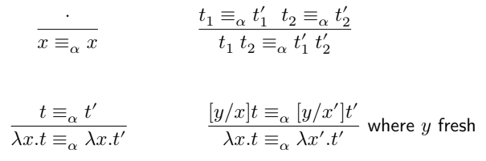

# Lesson 8

In this lab we will implement the functions and predicates used for lambda-computation to get a way to evaluate lambda-expressions and test their equality.

## Variables

### Generating new variables

An important part of the modulo alpha-equivalence substitution process is the ability to rename variables related to new versions of them, thus avoiding the problem of capturing variables.

We will consider the variables as being indexed by an integer:

```haskell
data Variable = Variable String Int
```

The first argument of the `Variable` constructor will represent the name of the variable and the second will use to be able to differentiate between variables with the same name.

We can also define a simple constructor for variables:

```haskell
var :: String -> Variable
var x = Variable x 0
```

### Exercises

1. Write a function

    ```haskell
    fresh :: Variable -> [Variable] -> Variable
    ```

    that produces a new variable, with the same name as the first argument, but different from it and any variable in the given list.

    ```haskell
    fresh (Variable "x" 0) [Variable "y" 2, Variable "x" 1] == Variable "x" 2
    ```

2. Make `Variable` an instance of the `Show` class, to obtaint the following behavior:

    ```haskell
    show (Variable "x" 0) == "x"
    show (Variable "x" 14) == "x_14"
    ```

## Abstract syntax and free variables

```haskell
data Term
    = V Variable
    | App Term Term
    | Lam Variable Term

v :: String -> Term
v x = V (var x)

lam :: String -> Term -> Term
lam x = Lam (var x)

lams :: [String] -> Term -> Term
lams xs t = foldr lam t xs

($$) :: Term -> Term -> Term
($$) = App
infixl 9 $$
```

### Exercises

3. Make `Term` an instance of the `Show` class to get a completely bracketed representation of the lambda-expressions.

```haskell
show (v "x")                    == "x"
show (v "x" $$ v "y")           == "(x y)"
show (lam "x" (v "x"))          == "(\x.x)"
show (lams ["x","y"] (v "x"))   == "(\x.(\y.x))"
```

4. Define a function

    ```haskell
    freeVars :: Term -> [Variable]
    ```

    which calculates free variables in a term.

    ```haskell
    freeVars (lam "x" (v "x" $$ v "y")) == [var "y"]
    ```

5. Define a function

    ```haskell
    allVars :: Term -> [Variable]
    ```

    that calculates all variables (free or linked) in a term.

    ```haskell
    allVars (lam "x" (v "x" $$ v "y")) == [var "x", var "y"]
    ```

## Substitution

### Exercises

6. Define a function that implements the substitution of a term for a variable in a given term.

    ```haskell
    subst :: Term -> Variable -> Term -> Term
    subst u x (Lam y t)
        | x == y =
        | y `notElem` freeVarsU =
        | x `notElem` freeVarsT =
        | otherwise =
        where
            freeVarsT = freeVars t
            freeVarsU = freeVars u
            allFreeVars = nub ([x] ++ freeVarsU ++ freeVarsT)
            y' = freshVariable y allFreeVars
            t' = (subst (V y') y t)
    ```

## Alpha-conversion and alpha-equivalence

### Exercises

7. You are given the alpha-conversion rules.

    

    Write a function

    ```haskell
    aEq :: Term -> Bool
    ```

    that implements the above rules.

    ```haskell
    aEq (lam "x" (v "x")) (lam "y" (v "y")) == True
    aEq (lam "x" (v "x")) (lam "y" (v "z")) == False
    ```

## Beta-reduction and beta-equivalence

### Exercises

8.  Write a function

    ```haskell
    reduce :: Term -> Term
    ```

    that uses beta-reduction to evaluate a term to its normal form.

    ```haskell
    reduce
        (lams ["m", "n"] (v "n" $$ v "m")
        $$ lams ["s", "z"] (v "s" $$ (v "s" $$ v "z"))
        $$ lams ["s", "z"] (v "s" $$ (v "s" $$ (v "s" $$ v "z")))
        )
        ==
        lams ["s", "z"] (v "s" $$ (v "s" $$ (v "s" $$ (v "s"
        $$ (v "s" $$ (v "s" $$ (v "s" $$ (v "s" $$ v "z"))))))))
    ```

9.  Write a function

    ```haskell
    abEq :: Term -> Term -> Bool
    ```

    that tests whether two terms are beta-convertible like this:

    -   reduces both terms to a normal form
    -   checks if the normal shapes are alpha-convertible
