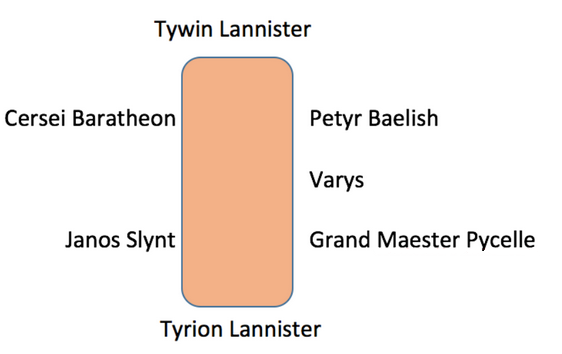
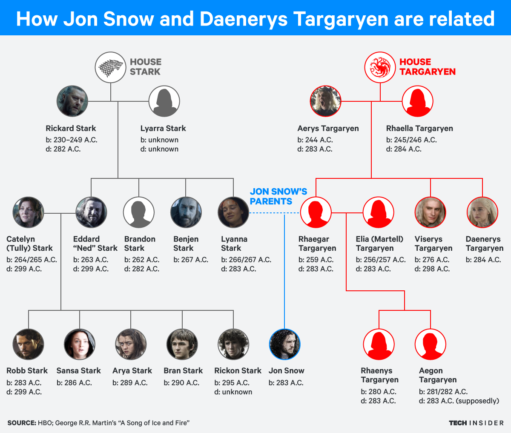

# Exercises

## Exercise 1

The following image shows how Joffrey's council members are sitting at the table:

<p align="center">
     
</p>

Define the predicate `sits_right_of/2` to determine who stands next to whom. `sits_right_of(X, Y)` must be true if `X` stands at the right of `Y`.

Add the following predicates:

-   `sits_left_of/2` - `sits_left_of(X, Y)` must be true if `X` is at the left of `Y`
-   `are_neighbors_of/3` - `are_neighbors_of(X, Y, Z)` must be true if `X` is at the left of `Z` and `Y` is at the right of `Z`
-   `next_to_each_other/2` - `next_to_each_other(X, Y)` must be true if `X` is next to `Y`

    Text your implementation by asking the following questions:

-   Is Petyr Baelish at the right of Cersei Baratheon?
-   is Petyr Baelish at the right of Varys?
-   Who is at the right of Janos Slynt?
-   Who is 2 seats at the right of Cersei Baratheon?
-   Who sits between Petyr Baelish and Grand Master Pycelle?

## Exercise 2

Use the `male/1`, `female/1`, and `parent_of/2` predicates to represent the following genealogical tree as a knowledge base in Prolog.

<p align="center">
     
</p>

Use the knowledge base in `kb4.pl` as a starting point.

Now add rules for the following predicates:

-   `father_of(Father, Child)`
-   `mother_of(Mother, Child)`
-   `grandfather_of(Grandfather, Child)`
-   `grandmother_of(Grandmother, Child)`
-   `sister_of(Sister, Person)`
-   `brother_of(Broth, Person)`
-   `aunt_of(Aunt, Person)`
-   `uncle_of(Uncle, Person)`

Verify your implementation by asking different questions. Use this Prolog program to find out if Daenerys Targaryen is Jon Snow's aunt.

## Exercise 3

Using the previous knowledge base, write a predicate `ancestor_of(Ancestor, Person)` that checks if the first argument is an ancestor of the second argument.

Example:

```prolog
?- ancestor_of(rickardStark, jonSnow).
true
```

## Exercise 4

Using the previous knowledge base (genealogical tree), test the `not_parent` predicate:

```prolog
?- not_parent(rickardStark, viserysTargaryen).
?- not_parent(X, jonSnow).
?- not_parent(X, Y).
```

What do you notice? Analyze the results.

-   Correnct `not_parent` so that it returns the right answer for all the queries above.
-   Write a predicate `ancestor_not_parent(X, Y)` that verifies that `X` is an ancestor of `Y`, but it is not a parent.

## Exercise 5

In Game of Thrones, there is a [riddle](https://goodriddlesnow.com/posts/view/riddle-from-game-of-thrones):

> Varys - "Power is a curious thing, my lord. Are you fond of riddles?"

> Tyrion - "Why? Am I about to hear one?"

> Varys - "Three great men sit in a room, a king, a priest and the rich man. Between them stands a common sellsword. Each great man bids the sellsword kill the other two. Who lives? Who dies?"

> Tyrion - "Depends on the sellsword"

We will describe this problem in Prolog, making the following presumptions:

-   if the sellsword is a religious man, then he won't kill the priest
-   if the sellsword is a man that respects the authority, then he won't kill the king
-   if the sellsword is a man that wants money, then he won't kill the rich man

In the `kb5.pl` file, there is a starting point for implementing the riddle. Complete the knowledge base and write a predicate `is_killed(C, X, Y)`, that verifies whether `X` and `Y` are killed by the sellsword's choice `C`.

```prolog
?- isKilled(god, X, Y).
X = king,
Y = richMan
```
