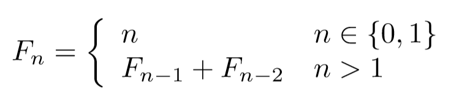

# Lesson 2

## Recursion

The first and most common recursion example is the Fibonacci sequence. Using the recursion, we can calculate a number of the Fibonacci sequence, given its index. The formula is:

<p align="center">

</p>

We can write this formula directly in Haskell:

```haskell
fibonacci :: Integer -> Integer
fibonacci n
    | n < 2     = n
    | otherwise = fibonacci (n - 1) + fibonacci (n - 2)
```

Another way to write this function is using patterns:

```haskell
fibonacci' :: Integer -> Integer
fibonacci' 0 = 0
fibonacci' 1 = 1
fibonacci' n =
    fibonacci' (n - 1) + fibonacci' (n - 2)
```

The problem with this definition is the exponential complexity. This happens because the result is made of 2 subproblems of an almost equal dimension to the original problem.

We can simplify the recursion, by recursively calculating the (F<sub>n-1</sub>, F<sub>n</sub>) pair.

## Exercise

1. Write a linear function for calculating the n-th fibonacci number.

    **Note 1:** Use the fact that `fibonacciPair (n-1)` calculates the (F<sub>n-2</sub>, F<sub>n-1</sub>) pair and we use the result to calculate the (F<sub>n-1</sub>, F<sub>n</sub>) pair.

    **Note 2:** The recursion is linear only if the recursive call appears only once. Use `let`, `case` or `where` to make sure the recursion is linear.

## List Recursion

Let's create a basic function named `semiEven` that takes as parameter a list of integers and returns a new list by removing the odd numbers and dividing by 2 the even numbers.

Example: `semiEven [0, 2, 1, 7, 8, 56, 17, 18] == [0, 1, 4, 28, 9]`

## List Comprehension

Haskell allows creating a list by selecting and modifying elements of another list.

The syntax is `[expression | selectors, links, filterings]`, where:

-   `expression` - expression defining the elements of the resulted list
-   `selectors` - one or more comma-separated `pattern <- anotherList` expressions, where `anotherList` is an expression that returns a list, and `pattern` is an alias for `anotherList` elements
-   `links` - none or more comma-separated `let pattern = expression` expressions, used to link the `pattern` variable to the `expression` value
-   `filterings` - zero or more comma-separated `Bool` expressions, used to remove the elements for which the expression is false

Example: the `semiEven` function from the previous exercise:

```haskell
semiEvenComprehension :: [Int] -> [Int]
semiEvenComprehension l = [x `div` 2 | x <- l, even x]
```

## Exercises

2. Write a function `inInterval` that takes as parameter the lower and upper bound of an interval and a list and returns the list of the numbers in the interval that can be found in the parameter list.

    Examples:

    `inInterval 5 10 [1..15] == [5,6,7,8,9,10]`

    `inInterval 5 10 [1,3,5,2,8,-1] == [5,8]`

-   use only recursion. Name the function `inIntervalRec`
-   use list comprehension. Name the function `inIntervalComp`

3. Write a function that counts how many positive numbers are in a given list.

    Example: `positives [0, 1, -3, -2, 8, -1, 6] == 3`

-   use only recursion. Name the function `positivesRec`
-   use list comprehension. Name the function `positivesComp`. You will need a function from Data.List

4. Write a function that takes as parameter a list and returns a list of positions where odd numbers are found in the original list.

    Example: `oddPositions [0,1,-3,-2,8,-1,6,1] == [1,2,5,7]`

-   use only recursion. Name the function `oddPositionsRec`. You can create another function that returns the position
-   use list comprehension. Name the function `oddPositionsComp`. You can use the `zip` function to link the element to its position in the list

5. Write a function that calculates the product of all the digits that appear in an input String. If there are no digits in the input string, then the answer will be 1.

    Examples:

    `digitsProduct "The time is 4:25" == 40`

    `digitsProduct "No digits here!" == 1`

-   use only recursion. Name the function `digitsProductRec`
-   use list comprehension. Name the function `digitsProductComp`. You can use the `isDigit` function that checks if a character is digit and `digitToInt` function that converts a character to an integer

6. Write a function that takes as parameter a list of numbers representing prices and applies a 25% discount on each element. The function must return a list of prices that are less than 200 after the discount.

    Example: `discount [150, 300, 250, 200, 450, 100] == [112.5, 187.5, 150.0, 75.0]`

-   use only recursion. Name the function `discountRec`
-   use list comprehension. Name the function `discountComp`.
