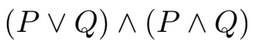
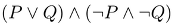
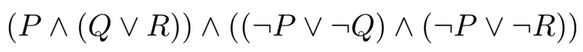

# Lesson 8 - Propositional logic

In this lesson, we will implement some functions to work with propositional logic in Haskell.

We define the following:

```haskell
type Name = String

data Prop
    = Var Name
    | F
    | T
    | Not Prop
    | Prop :|: Prop
    | Prop :&: Prop
    deriving Eq

infixr 2 :|:
infixr 3 :&:
```

The `Prop` type represents the propositional formulas. The propositional variables, like `p` or `q`, can be represented as `Var "p"` and `Var "q"`. The `F` and `T` constants represent `False` and `True`, the unary operator `Not` is the negation and the `:|:` and `:&:` operators are the disjunction and the conjunction operators.

## Exercises

1. Write the following formulas as `Prop` expressions, naming them `p1`, `p2` and `p3`.

    a) 

    ```haskell
    p1 :: Prop
    p1 = (Var "P" :|: Var "Q") :&: (Var "P" :&: Var "Q")
    ```

    b) 

    ```haskell
    p2 :: Prop
    p2 = undefined
    ```

    c) 

    ```haskell
    p3 :: Prop
    p3 = undefined
    ```

2. Make the `Prop` type an instance of the `Show` class, replacing `Not`, `:|:` and `:&:` with `~`, `|` and `&` and the `Var v` with the variable name.

    ```haskell
    instance Show Prop where
        show = undefined

    test_ShowProp :: Bool
    test_ShowProp =
        show (Not (Var "P") :&: Var "Q") == "((~P)&Q)"
    ```

3. (Optional) Change the `show` definition so that the parenthesis are used only when necessary. Notice that a subexpression of an operator must be placed between parenthesis only if its precedence is lower than the operator's. Thus, because the `Not` precedence is the application's and the `:|:` and `:&:` precedence are 3 and 2 respectively:

    a) The expression under `Not` must be placed between parentheses only if its higher operator is `:|:` or `:&:`

    b) A subexpression of `:&:` must be placed between parentheses only if its higher operator is `:|:`

## Logical expressions evaluation

To evaluate a logical expression, we must consider an evaluation environment, that assigns `Bool` values to the propositional variables:

```haskell
type Env = [(Name, Bool)]
```

The `Env` type is a list of assignments of boolean values to the (names of the) variables.

To get the value associated with a `Name` variable in `Env`, we can use the predefined function `lookup :: Eq a => a -> [(a, b)] -> Maybe b`.

To simplify the next exercises, we eill use a new version of `lookup`, that throws an error if the value is not found.

```haskell
impureLookup :: Eq a => a -> [(a,b)] -> b
impureLookup a = fromJust . lookup a
```

## Exercises

4. Write a function `eval` that, given a logical expression and an evaluation environment, calculates the truth value of the expression.

    ```haskell
    eval :: Prop -> Env -> Bool
    eval = undefined

    test_eval = eval (Var "P" :|: Var "Q") [("P", True), ("Q", False)] == True
    ```

## Satisfiability

A formula in propositional logic is satisfiable if there is one assignment of boolean values to the variables in the formula for which the formula evaluates to `True`.

To verify if a formula is satisfiable, we will generate all the possible assignments of boolean values to the variables and we will test if the formula is `True` for any of them.

## Exercises

5. Write a function `variables` that collects the list of all variables in a formula. Note: use the `nub` function.

    ```haskell
    variables :: Prop -> [Name]
    variables = undefined

    test_variables =
        variables (Not (Var "P") :&: Var "Q") == ["P", "Q"]
    ```

6. Given a `Name` list, generate all the assignments of boolean values to each variable in the list.

    ```haskell
    envs :: [Name] -> [Env]
    envs = undefined

    test_envs =
        envs ["P", "Q"]
        ==
        [[("P",False)
        , ("Q",True)
        ]
        ,[("P",False)
        , ("Q",False)
        ]
        ,[("P",True)
        , ("Q",True)
        ]
        ,[("P",True)
        , ("Q",False)
        ]
        ]
    ```

7. Write a function `satisfiable` that, given a `Prop`, verifies that it's satisfiable.

    ```haskell
    satisfiable :: Prop -> Bool
    satisfiable  = undefined

    test_satisfiable1 = satisfiable (Not (Var "P") :&: Var "Q") == True
    test_satisfiable2 = satisfiable (Not (Var "P") :&: Var "P") == False
    ```

8. A formula is valid if, for any variable interpretation, it's evaluated to `True`. In other words, a formula is valid if its negation is not satisfiable.

    Write a function `valid` that checks whether the predicate is satisfiable.

    ```haskell
    valid :: Prop -> Bool
    valid = undefined

    test_valid1 = valid (Not (Var "P") :&: Var "Q") == False
    test_valid2 = valid (Not (Var "P") :|: Var "P") == True
    ```

9. All the evaluations of a formula can be represented using the truth table.

    ```
    P Q |    (P&(~Q))
    - - | --------------
    F F |       F
    F T |       F
    T F |       T
    T T |       F
    ```

    Write a function `truthTable` that prints the truth table of an expression, so that each row in the table is separated by the `\n` character.

    ```haskell
    truthTable :: Prop -> String
    truthTable = undefined
    ```

    Example:

    ```haskell
    *Main> truthTable (Var "P" :&: Not (Var "Q"))
    "P Q (P&(~Q))\nF T F \nF F F \nT T F \nT F T \n"
    ```

    To show the table on different lines, we use the `putStrLn` function.

    ```haskell
    *Main> putStrLn $ truthTable (Var "P" :&: Not (Var "Q"))
    P Q (P&(~Q))
    F T F
    F F F
    T T F
    T F T
    ```

## Logical implication and logical equivalence

## Exercises

10. Extend the `Prop` data type and all the functions defined in this lesson to include the logical implication operator `->` and the logical equivalence operator `<->`, using the `:->:` and `:<->:` constructors.

    Test the following formula and verify the truth table:

    ```haskell
    *Main> putStrLn $ truthTable (Var "P" :->: Var "Q")
    P Q | (P->Q)
    - - | ------
    F T |    T
    F F |    T
    T T |    T
    T F |    F

    *Main> putStrLn $ truthTable (Var "P" :<->: Var "Q")
    P Q | (P<->Q)
    - - | -------
    F T |    F
    F F |    T
    T T |    T
    T F |    F
    ```

11. Two logical propositions are equivalent if they have the same truth value, regardless the values of the logical variables values. Write a function that checks if two logical propositions are equivalent. 

    ```haskell
    equivalent :: Prop -> Prop -> Bool
    equivalent = undefined

    test_equivalent1 =
        True
        ==
        (Var "P" :&: Var "Q") `equivalent` (Not (Not (Var "P") :|: Not (Var "Q")))

    test_equivalent2 =
        False
        ==
        (Var "P") `equivalent` (Var "Q")

    test_equivalent3 =
        True
        ==
        (Var "R" :|: Not (Var "R")) `equivalent` (Var "Q" :|: Not (Var "Q"))

    ```
